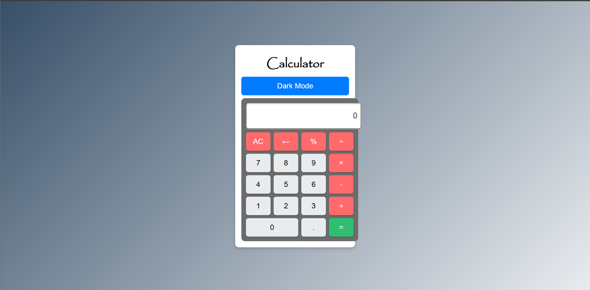
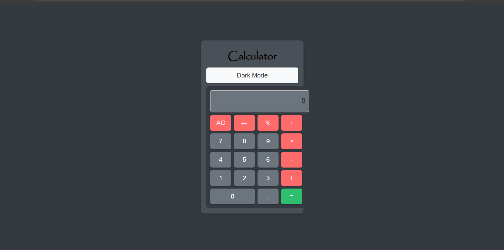

# Calculator Web Application

This is a simple yet functional calculator web application built using HTML, CSS, and JavaScript. The calculator supports basic arithmetic operations, memory functions, and a toggleable dark mode for enhanced user experience. It is designed to be responsive and works seamlessly across different devices and screen sizes.

---

## Features

- **Basic Arithmetic Operations**: Addition, subtraction, multiplication, and division.
- **Memory Functions**: Store, recall, and clear memory values.
- **Percentage Calculation**: Easily calculate percentages.
- **Dark Mode**: Toggle between light and dark themes.
- **Keyboard Support**: Use your keyboard to input numbers and perform calculations.
- **Responsive Design**: Optimized for both desktop and mobile devices.

---

## Screenshots

### Light Mode


### Dark Mode


---

## How to Run the Application

### Prerequisites

- A modern web browser (e.g., Chrome, Firefox, Safari, Edge).
- A code editor (optional, for viewing or modifying the code).

### Running the Application

#### Windows

1. **Download the Project**:
   - Clone the repository or download the ZIP file and extract it to a directory on your computer.

2. **Open the Project**:
   - Navigate to the directory where you extracted the files.
   - Double-click the `index.html` file to open it in your default web browser.

3. **Use the Calculator**:
   - The calculator should now be running in your browser. You can start using it immediately.

#### macOS

1. **Download the Project**:
   - Clone the repository or download the ZIP file and extract it to a directory on your computer.

2. **Open the Project**:
   - Navigate to the directory where you extracted the files.
   - Right-click the `index.html` file and select "Open With" > "Google Chrome" (or any other browser).

3. **Use the Calculator**:
   - The calculator should now be running in your browser. You can start using it immediately.

#### Linux

1. **Download the Project**:
   - Clone the repository or download the ZIP file and extract it to a directory on your computer.

2. **Open the Project**:
   - Open a terminal and navigate to the directory where you extracted the files.
   - Run the following command to open the `index.html` file in your default web browser:
     ```bash
     xdg-open index.html
     ```

3. **Use the Calculator**:
   - The calculator should now be running in your browser. You can start using it immediately.

---

## Project Structure

- **`index.html`**: The main HTML file that contains the structure of the calculator.
- **`style.css`**: The CSS file that defines the visual styling of the calculator, including the light and dark themes.
- **JavaScript**: Embedded within the `index.html` file, it handles the logic for calculations, memory functions, and theme toggling.

---

## Customization

- **Theme Customization**: You can modify the colors in the `style.css` file to create your own custom themes.
- **Functionality**: You can extend the calculator's functionality by adding more JavaScript functions or modifying existing ones.

---

## Contributing

If you would like to contribute to this project, feel free to fork the repository and submit a pull request. Your contributions are welcome!

---

## License

This project is open-source and available under the MIT License. See the `LICENSE` file for more details.

---

## Author

**Md Islam**  
- GitHub: https://github.com/mdislam1  

---

Enjoy using the calculator! If you have any questions or feedback, please feel free to open an issue on GitHub.
